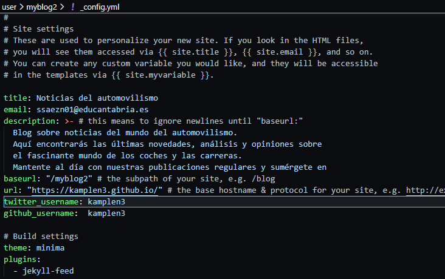
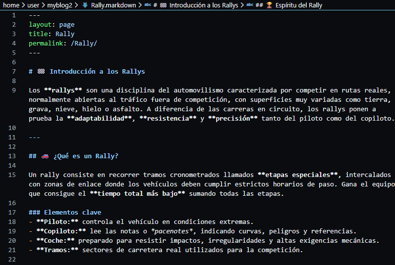

# Ejercicio 1 Instalación de Jekyll y subida a GH-Pages

## 1. Instalación del tema por defecto

### Para crear el nuevo blog mediante Jekyll usando `Jekyll new .` dentro de nuestro repositorio, el tema minima es el predeterminado por lo que no requiere configuración.

## 2. Configuración del tema

### Ahora para modificar la portada tendremos que modificar el archivo _config.yml.

## 3. Personalización del diseño

### Tenemos que modificar los archivos de Index.markdown y about.markdown para darle un diseño a nuestra página web.

### Tambien creamos una nueva página .markdown que aparecerá al lado de about y podremos acceder a su contenido.

## 4. Creación de los Posts

### Ahora creamos el contenido de la página que seran los distintos post, estos se crean el la carpeta `_posts`

## 5. Resultados

### El resultado de esta configuración quedara de una manera similar

