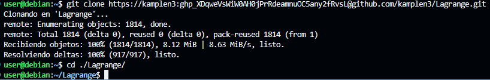
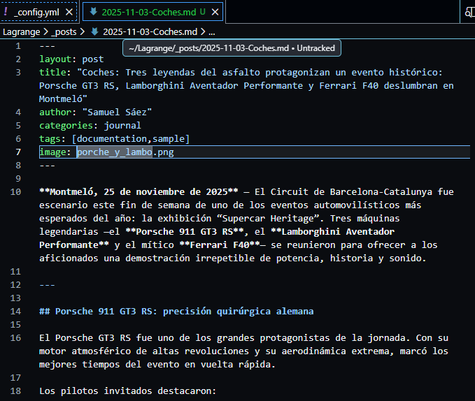
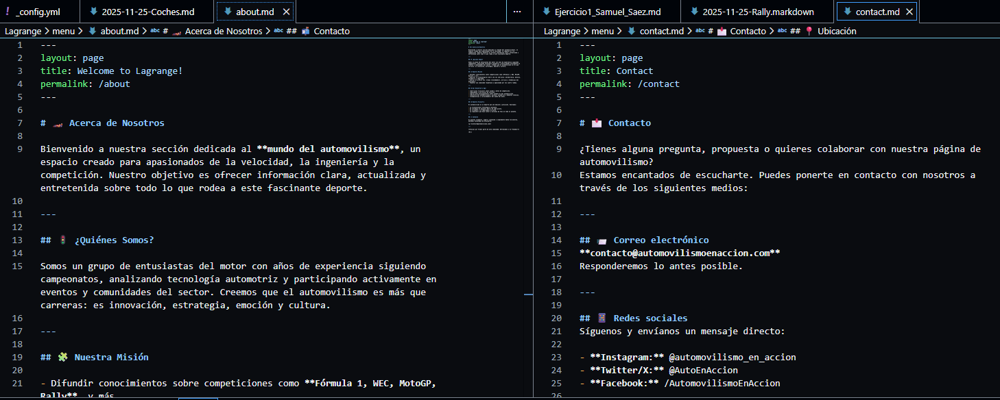

# Ejercicio 1 Instalación de Jekyll y subida a GH-Pages

## 1. Creación del sitio Jekyll 

### Para crear el nuevo blog mediante Jekyll usando `Jekyll new .` dentro de nuestro repositorio, el tema minima es el predeterminado por lo que no requiere configuración.

### Ahora para modificar la portada tendremos que modificar el archivo _config.yml.

### Tenemos que modificar los archivos de Index.markdown y about.markdown para darle un diseño a nuestra página web.

### Tambien creamos una nueva página .markdown que aparecerá al lado de about y podremos acceder a su contenido.

### Ahora creamos el contenido de la página que seran los distintos post, estos se crean el la carpeta `_posts`

### El resultado de esta configuración quedara de una manera similar

## 2. Creación del sitio con tema lagrange

### Ahora tenemos que hacer un fork al repositorio original con el tema lagrange

### Después tenemos que clonar este repositorio en nuestro maquina para trabajar con él.

### Ahora al igual que en el tema minima tendremos que editar el _config.yml y modificarlo

### Despues de configurar tendremos que volver a crear todos los post que vamos a tener, de una manera similar al minima

### Con los posts creados podemos dar una mejor personalización al blog cambiando los archivos de About y Contact para dar un toque más personal.

