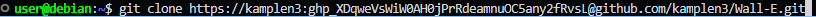
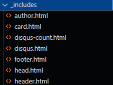
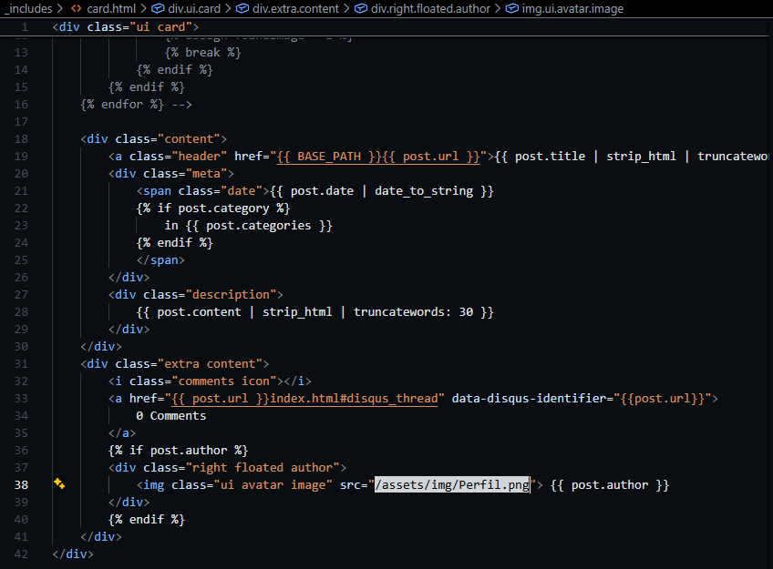
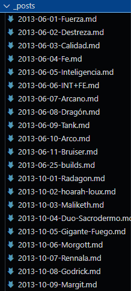

# Ejercicio 3 Creación del sitio con tema propio

## 1.Instación del Wall-E

### Tenemos que hacer un fork al repositorio original con el tema Wall-E

### Después de hacer el fork tenemos que clonar el repositorio en local para poder asi configurar el blog.
### Para esto tendremos que usar `Git clone (URL del repositorio)`

## 2.Configuración del tema

### Con el repositorio clonado tendremos que configurar, al igual que el resto de temas, el archivo config.yml donde iran los datos básicos como titulo, descripcion,el directorio raiz...

### Con la el config acabado podemos pasar a personalizar la pagina, en la carpeta _includes en este caso podemos encontrar distintos elementos personalizables.

### Por ejemplo en el card.html podemos personalizar los post que se ven desde home, cambiando la ultima linea podemos hacer que la imagen del autor que se muestra cambie.

## 3.Creacion de los Posts

### Para empezar a crear los post tenemos que dirigirnos a la carpeta _posts, donde se encuentran algunos ejemplos.
### Nosotros solo tenemos que cambiar el texto que se encuentra dentro de uno de los precreados y la cabecera ajustarla para que cuadre con el contenido y el autor.

## 4.Personalización

### Para darle un toque más personal podemos cambiar distintos apartados del blog como about y archive.
### Para cambiar estos apartados tenemos que dirigirnos a about.html y archive.html respectivamente donde podremos cambiar el contenido y el nombre con el que aparecen en el blog.

## 5.Subida al sitio Netlify

### Para subir el blog a Netlify, después de ya haberlo subido a GitHub, tendremos que ir a la página Web de Netlify e iniciar sesión.
### Con la sesión iniciada podremos subir un repositorio de github 

### Al seleccionar el repositorio tendremos que indicar la rama que se va a subir y un nombre. Continuando no tendría que dar ningún error y generaría un pagina web.

## 6.Resultado

### Asi tendría que quedar.

